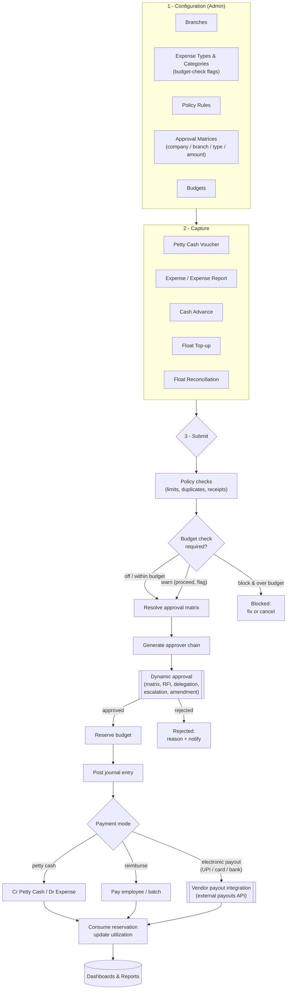

# Statement of Work (SOW)
## Small Payment Management — Odoo 19 Petty Cash, Employee Expense & Reimbursement

| | |
|---|---|
| **Provider** | Ideenkreise Tech |
| **Client** | _«Client Name»_ |
| **Project** | Small Payment Management (`small_payment_management`) on Odoo 19 Community Edition |
| **Document version** | 1.0 (Draft) |
| **Date** | June 2026 |
| **Reference** | `odoo19-petty-cash-expense-solution-report.md` (Solution Architecture & Implementation Report); `docs/vendor-payout-integration-research.md` (Vendor Electronic Payout Integration) |

---

## 1. Background & Purpose

The Client requires an enterprise-grade petty cash, employee expense and
reimbursement system on **Odoo 19 Community Edition**, deployed on-premise in
Docker (Odoo built from official source, no prebuilt cloud image). The solution
is delivered as a **single custom module** (`small_payment_management`) plus
selected free third-party/OCA modules, and adds a **model-agnostic dynamic
approval engine**, operational budget control, OWL dashboards and a reporting
pack.

This SOW defines the scope, deliverables, timeline and acceptance criteria for
the engagement. The full technical design is in the referenced Solution Report.

### 1.1 Pain points addressed

The engagement targets concrete, recurring failures of manual / spreadsheet /
email-based petty-cash, expense and vendor-payment processes:

| Pain point (typical status quo) | How this solution fixes it |
|---|---|
| Petty cash run on paper/spreadsheets — no live float balance, reconciliation gaps, cash leakage, no custodian accountability | Imprest floats with computed balance, replenishment thresholds, auto-replenishment suggestion, cash-count reconciliation with variance posting under approval |
| Approvals over email/chat/paper — slow, lost, no audit, unclear who is next, bottlenecks; "approve low then raise the amount" abuse | Dynamic approval matrix auto-resolved by company/branch/type/category/amount; ordered tiers (single/all/quorum); amount-change re-resolution; every action logged |
| Real-life exceptions break the flow: approver on leave, needs clarification, or the chain must change mid-approval | Request for Information (pauses the SLA clock), standing + active-approver delegation, live audited add/remove of approvers with guardrails |
| Overspend discovered only after posting — no control before money is committed | Operational pre-commitment budgets with a reservation ledger; off/warn/block enforcement; over-budget badge shown to approvers |
| Weak segregation of duties (one person requests/approves/pays); records deleted to hide history; exceptions invisible to audit | SoD enforced in code (requester ≠ approver ≠ poster ≠ payout releaser); no deletion after submission; append-only amendment log; exception reports |
| No branch-level visibility or security; cannot produce branch P&L or budgets | Branch dimension + analytic tagging on every transaction; branch record rules; branch-filtered dashboards and reports |
| Management cannot see spend, budget vs actual or approval cycle time; staff cannot see their claim status | Management and "My Wallet" OWL dashboards + a full report pack (registers, utilization, SLA/cycle time, exceptions) |
| Cash advances handed out but never tracked or settled; reimbursements slow and manual | Advance ledger with settlement against later claims; reimbursement batches |
| Vendor payments made manually (cash/cheque/manual transfer) — disconnected from approval, beneficiary keying errors, double-payments, no UTR/audit, manual reconciliation, slow (no UPI/instant rails), TDS not deducted, beneficiaries not KYC-verified | Optional electronic vendor payout integration (S12/§4.3): pay from approved documents via UPI/IMPS/NEFT/RTGS/card; pay-after-approval + segregated release; idempotency prevents double-payment; signed webhooks create and reconcile the `account.payment` and capture the UTR; beneficiary KYC; optional TDS |
| Enterprise licensing cost and cloud lock-in | Community Edition built from source, on-prem Docker, OCA/free modules, no prebuilt Odoo image |

> See the Solution Report §1.1 for the detailed pain-point → solution mapping
> with section references.

---

## 2. Objectives

1. Multi-company, multi-branch petty cash (imprest) management.
2. Employee expense capture, reporting and reimbursement (incl. cash advances).
3. Dynamic approval workflows auto-populated by company, branch, expense type,
   category and amount — with RFI, delegation, live add/remove of approvers,
   SLA escalation and an immutable audit trail.
4. Optional, per-master budget control with pre-commitment reservation and
   utilization tracking.
5. Management and individual ("My Wallet") dashboards plus a full report pack.
6. Containerized, reproducible on-premise deployment with backups/DR.

---

## 3. Process Overview (Workflow Diagram)

End-to-end flow delivered by this engagement (full diagram set:
[`docs/workflow.md`](workflow.md)):

---

## 4. Scope of Work

### 4.1 In scope

| # | Work item | Notes |
|---|---|---|
| S1 | Dockerized Odoo 19 CE built from source + PostgreSQL 16 | 2-container compose; single-container variant documented |
| S2 | Integration of free third-party/OCA modules | base_accounting_kit, dynamic_accounts_report, om_account_budget, OCA tier-validation / mis-builder / web, pinned commits |
| S3 | `small_payment_management` module — masters | Branch, expense type/category, policy rules, security (groups + record rules) |
| S4 | Dynamic approval engine | Matrices, ordered chains, RFI, delegation (admin + active approver), live add/remove, SLA escalation, immutable audit |
| S5 | Petty cash subsystem | Floats, top-ups, disbursement vouchers, reconciliation, postings |
| S6 | Employee expense & reimbursement | hr_expense extensions, advances, reimbursement batches |
| S7 | Budget control | Operational budgets, reservation ledger, utilization, enforcement modes |
| S8 | Dashboards (OWL) | Management dashboard + "My Wallet" |
| S9 | Reporting pack | Statutory (via 3rd-party) + custom operational QWeb/XLSX reports |
| S10 | Security & compliance | Multi-company + branch record rules, SoD, audit trail |
| S11 | Deployment, backups/DR, documentation, training, UAT support | Per roadmap Phase 7 |
| S12 | Vendor electronic payout integration (UPI / cards / bank) | Outbound payouts via an external aggregator API (RazorpayX / Cashfree); see §4.3 and `docs/vendor-payout-integration-research.md`. Optional add-on — Phase 8 |

### 4.2 Out of scope (unless agreed via Change Request)

- Data migration from legacy systems (handled via a separate Change Request).
- Payroll, full accounting implementation beyond the modules listed, or
  non-listed integrations (direct bank host-to-host / corporate-banking file
  exchange, e-invoicing, etc.). *Note:* outbound vendor payouts via an external
  aggregator **API** are covered by S12/§4.3; direct bank host-to-host is not.
- Odoo Enterprise licensing or Enterprise-only features.
- Custom mobile apps (the solution is mobile-friendly via responsive web).
- Ongoing hosting/managed services and post-warranty support (separate SLA).
- Translations beyond the languages agreed at kickoff.

### 4.3 Vendor electronic payout integration (UPI / cards / bank) — S12

Enables paying vendors directly from approved documents (petty-cash vouchers with
`payee_type = vendor`, reimbursement batches, and optionally standard vendor bills)
through an external **payouts API**. This is an **outbound disbursement** capability
and is deliberately *not* built on Odoo's inbound `payment.provider` framework. Full
technical design: `docs/vendor-payout-integration-research.md`.

| Item | Detail |
|---|---|
| Provider | RazorpayX Payouts first, behind a **provider-agnostic** interface so Cashfree (or a card-funded provider) can be added later without touching the document models |
| Rails | UPI (VPA), IMPS, NEFT, RTGS, and payout-to-card; provider/account-balance funded |
| Odoo design | New `spm.payout` transaction + `spm.payout.provider` config + beneficiary (bank/VPA) and verification fields on partners; payout drives a posted, reconciled `account.payment` |
| Lifecycle | Async, provider-driven: `queued → processing → processed / reversed / failed`, with signed webhooks, status-poll fallback and retry |
| Controls | Payout only after final approval; **maker–checker / SoD** (releaser ≠ approver); mandatory **idempotency keys**; **HMAC webhook verification**; secrets as restricted system parameters; beneficiary KYC/penny-drop before first payout; optional **TDS** deduction; immutable audit |
| Excluded | Card-as-funding-source products (EnKash/Karbon/Volopay), payout-to-card and non-INR rails are deferred to a later phase / Change Request unless agreed at kickoff |

> The payout provider account, KYC and current-account funding are arranged and
> owned by the Client (see §8). The Provider integrates against the Client's
> provider account in test mode, then live.

---

## 5. Deliverables

| # | Deliverable | Acceptance artifact |
|---|---|---|
| D1 | `small_payment_management` Odoo module (source) | Installs cleanly on staging; passes automated tests |
| D2 | Docker build (Dockerfile, compose, addon pins) | Reproducible build from source; runs on Client host |
| D3 | Configured masters, approval matrices, budgets | Signed-off configuration workbook |
| D4 | Dashboards & report pack | Demonstrated against UAT scenarios |
| D5 | Security model (roles, record rules, SoD) | Role-based UAT sign-off |
| D6 | Documentation (admin + user guides, this SOW, solution report, workflow) | Delivered in `docs/` |
| D7 | Training (admin + key users) | Training session(s) completed |
| D8 | UAT support + go-live + warranty | Go-live checklist completed |
| D9 | Vendor electronic payout integration (S12, optional) | Payouts demonstrated end-to-end in provider **test** mode (create → webhook → reconciled `account.payment`), then live sign-off |

---

## 6. Approach & Timeline

Phased delivery per the Solution Report §13. **Estimated effort: 10–14 weeks**
with a 2–3 person team (1 senior Odoo developer, 1 developer, 1 functional
consultant/QA).

| Phase | Duration | Key outcome |
|---|---|---|
| 0 — Foundation | 1 wk | Docker stack + 3rd-party modules on staging |
| 1 — Masters & security | 2 wks | Branches, types, categories, policies, security |
| 2 — Approval engine | 2–3 wks | Matrices + runtime engine + tests |
| 3 — Petty cash | 2 wks | Floats, top-ups, vouchers, reconciliation |
| 4 — Expenses & reimbursement | 2 wks | hr_expense extensions, advances, batches |
| 5 — Budgets | 1–2 wks | Operational budgets + utilization |
| 6 — Dashboards & reports | 2 wks | OWL dashboards + report pack |
| 7 — UAT & hardening | 1–2 wks | UAT, performance, backup drill, go-live |
| 8 — Vendor payout integration (optional, S12) | 2–3 wks | `spm.payout` + provider service, idempotency, signed webhooks, reconciliation; live in provider test then production |

Phase 8 is an optional add-on; if commissioned it extends the overall estimate
by ~2–3 weeks.

---

## 7. Roles & Responsibilities

| Party | Responsibilities |
|---|---|
| **Provider (Ideenkreise Tech)** | Design, build, configure, test, document, train; deliver per milestones |
| **Client** | Provide infrastructure/host access, chart of accounts & opening balances, branch/role data, timely UAT and sign-offs, a project sponsor and SMEs |
| **Shared** | Weekly status, risk/issue log, change control |

---

## 8. Assumptions & Dependencies

1. Odoo 19 CE source and the listed 3rd-party/OCA modules are available and
   license-compatible at build time (custom module covers gaps where an OCA
   19.0 port is not yet published — Solution Report §14).
2. Client provides a Linux Docker host meeting the stated prerequisites.
3. One Odoo database with multi-company; branch handled via the custom branch
   master (or OCA Operating Unit if its 19.0 port is adopted).
4. Client makes SMEs available for requirements confirmation and UAT.
5. Approval matrices and budgets are signed off by Client finance before go-live.
6. *(If S12 / Phase 8 is commissioned)* The Client holds the payout-provider
   account (RazorpayX / Cashfree), completes provider KYC and legal-entity
   current-account onboarding, funds the payout balance, and provides test + live
   API credentials and webhook configuration. Beneficiary KYC/bank verification and
   any TDS treatment are confirmed with Client finance. Payouts are INR-only unless
   otherwise agreed.

---

## 9. Acceptance Criteria

- Module installs and upgrades cleanly on staging and production.
- Automated tests pass; UAT scenarios (per role) executed and signed off.
- Go-live checklist (Solution Report §13) completed: CoA & petty cash GL,
  branches + analytic plan, types/categories with budget ticks, approval
  matrices, budgets loaded, opening float balances, user-role assignment,
  verified backup job.
- Acceptance is deemed given on Client sign-off, or after **10 business days**
  of production use without a Severity-1 defect, whichever is earlier.

---

## 10. Change Control

Any change to scope, deliverables, timeline or cost is handled via a written
**Change Request** (impact assessment + revised estimate), approved by both
parties before work proceeds.

---

## 11. Warranty & Support

- **Warranty:** 30 days from go-live covering defects against agreed specs at
  no additional charge.
- **Support & maintenance:** optional, under a separate SLA (response/resolution
  targets, channels, hours).

---

## 12. Sign-off

| | Provider — Ideenkreise Tech | Client — _«Client Name»_ |
|---|---|---|
| Name | | |
| Title | | |
| Signature | | |
| Date | | |

---

*This SOW is a draft for discussion and is not a binding offer until executed by
both parties. Placeholder values «…» are to be completed during contracting.*
