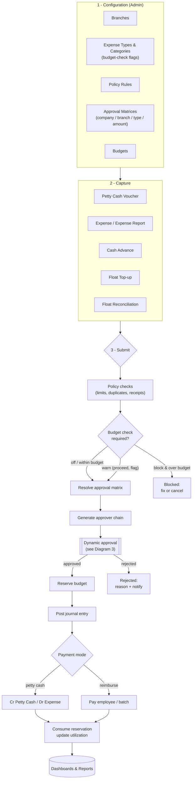
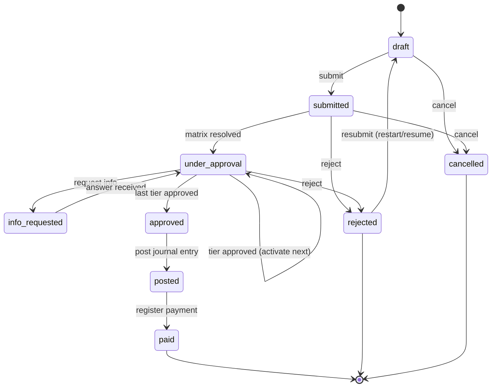
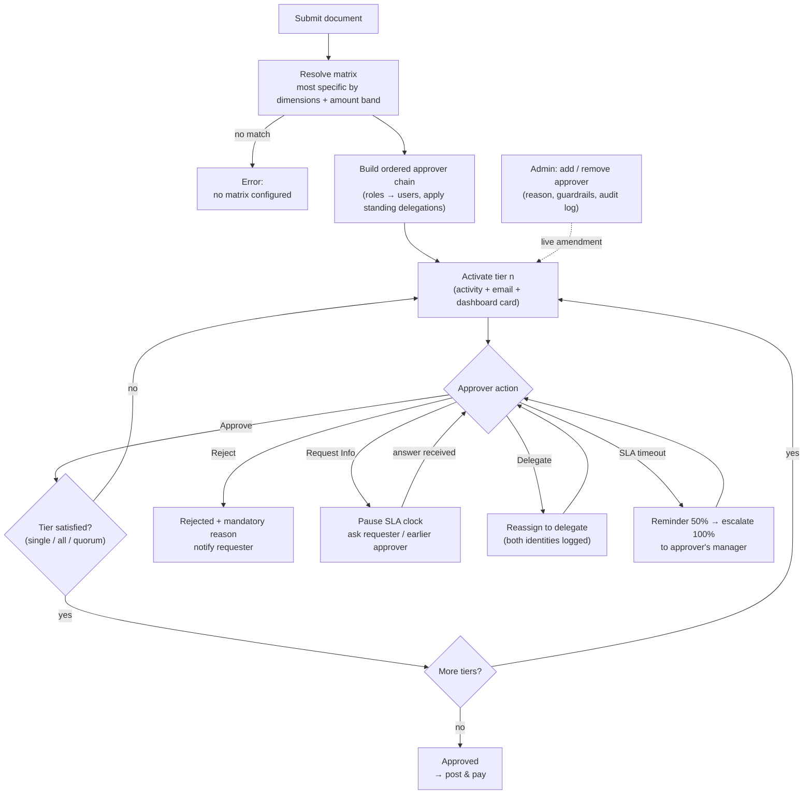
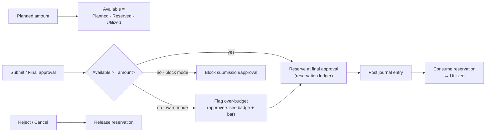
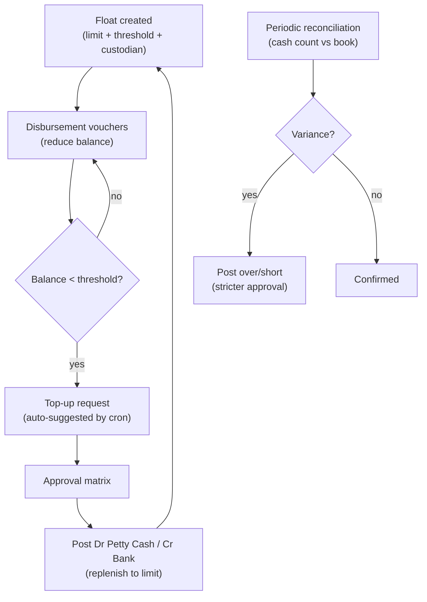

# Small Payment Management — Workflow Diagrams

End-to-end process for the `small_payment_management` module. Diagrams use
[Mermaid](https://mermaid.js.org/) and render directly on GitHub. Section
references (§) point to `odoo19-petty-cash-expense-solution-report.md`.

---

## 1. End-to-end process

---

## 2. Document lifecycle (shared state pattern, §6.2)

> Users never edit `state` directly — transitions are guarded by the engine.
> Submitted documents are never deleted: cancel-with-reason instead (§12.3).

---

## 3. Dynamic approval engine (§7)

Guardrails (enforced in code, §7.7–7.8): cannot alter an already-approved tier,
cannot remove the last path to completion, no self-approval / SoD violation,
every amendment is reason-mandatory and written to the immutable amendment log.

---

## 4. Budget control & utilization (§8)

> Checked at submit (early feedback) and re-checked at final approval with row
> locking (race-safe). The "tick in masters" (`budget_check_required`) decides
> whether the gate engages at all (§6 R6, §8.3).

---

## 5. Petty cash imprest cycle (§6.3)

---

## Roles in the flow (§12.1)

| Role | Acts at |
|---|---|
| Employee / Custodian | Capture & submit (vouchers, expenses, advances, top-ups) |
| Approver | Approve / reject / RFI / delegate within the resolved matrix |
| Branch Finance | Branch-wide read, reimbursement prep, registers |
| Finance Manager | Post / pay, budget edit |
| Administrator | Masters, matrices, budgets, live approval amendments (no posting — SoD) |
| Auditor | Read-everything via the amendment log & reports |
